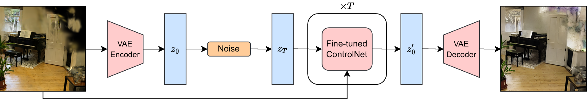
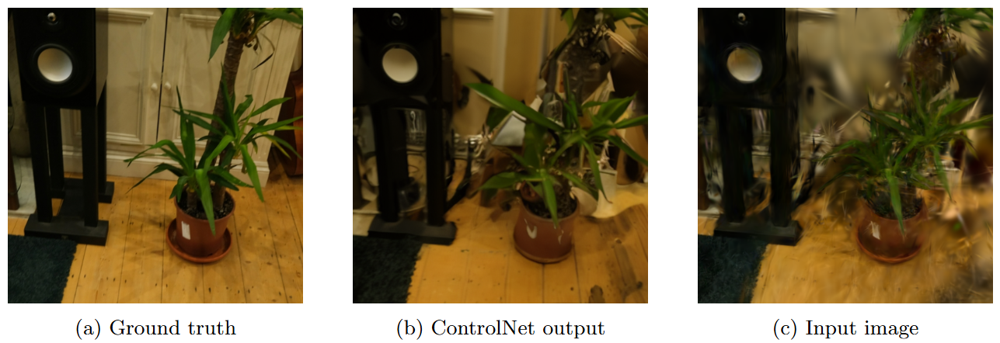
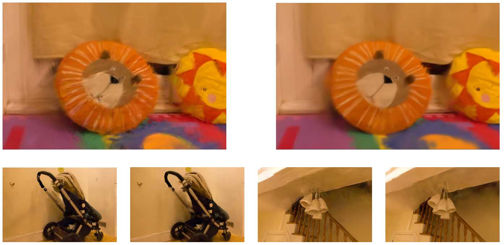

# Generative Gaussian Splatting
This project uses a fine-tuned diffusion model to fix common artefacts observed in Gaussian splatting scenes, augmenting the training data dynamically to improve reconstruction quality.

## The Diffusion Model

    

We train several image-to-image models for the task of removing splatting artefacts, and find that a fine-tuned Stable Diffusion ControlNet performs the best. To train this model, we first created a custom dataset of (noisy image, ground truth) pairs; this was achieved by training Gaussian splatting models with restricted training data, treating the remaining data as the test set.

Example output:

    

## Training Procedure

Our training procedure repeatedly trains to convergence, before augmenting the training data with new synthetic data. The new data is formed by taking existing views and slightly perturbing them (through small rotations and translations), rendering the new locations in the current scene (which will have slight artefacts), and fixing these with the pre-trained diffusion model. These fixed views are added to the dataset for the next round of training, and the process is repeated, effectively dynamically expanding the training dataset.

This method allows areas which are poorly represented in the original training dataset to gradually be included, leading to improved reconstructions in these areas. We test our result on the `playroom` scene, and significantly improve smoothness of the scene when compared to vanilla Gaussian splatting. See the three examples below, in which the scene trained with our method is shown on the right, and the original on the left.

    

